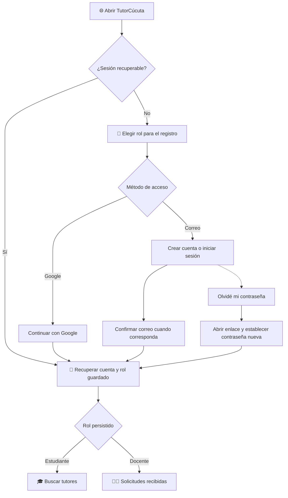
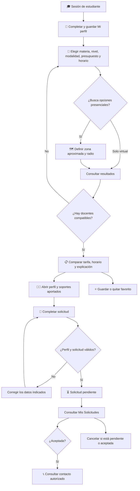
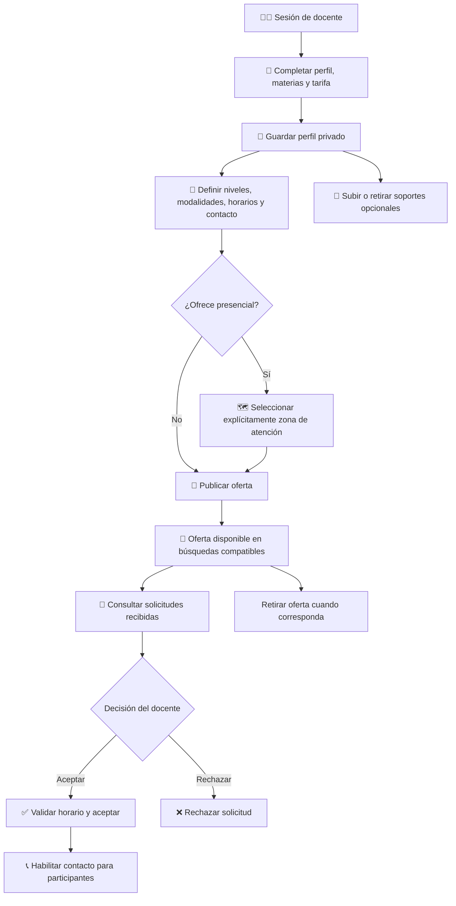
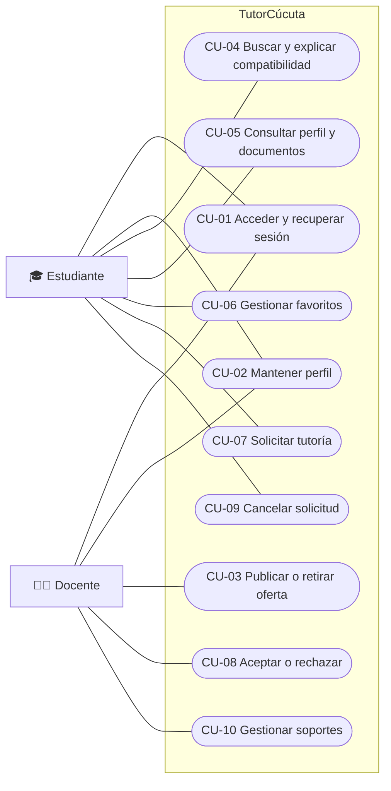
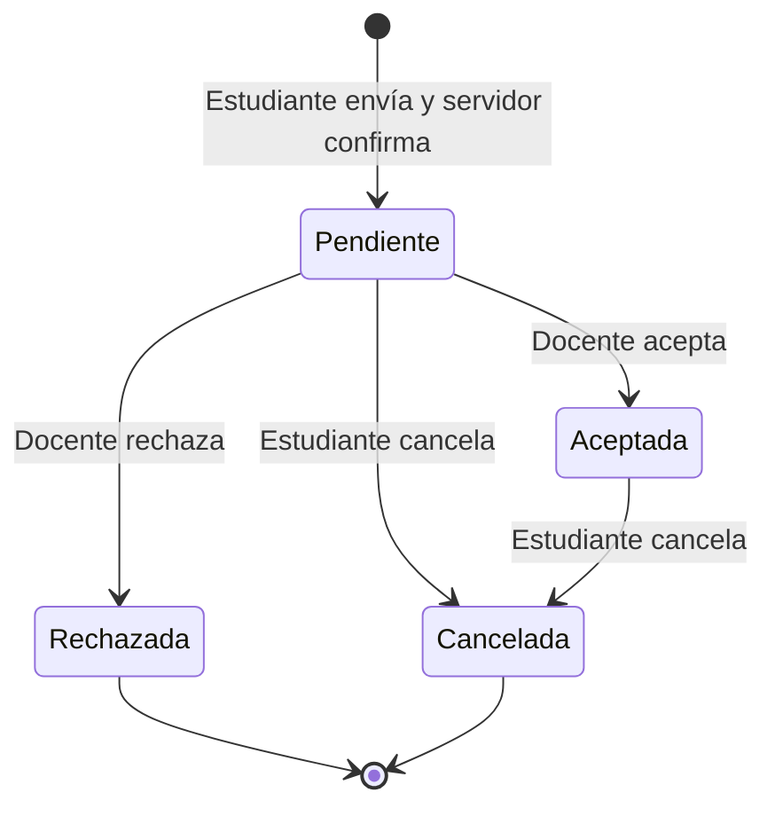
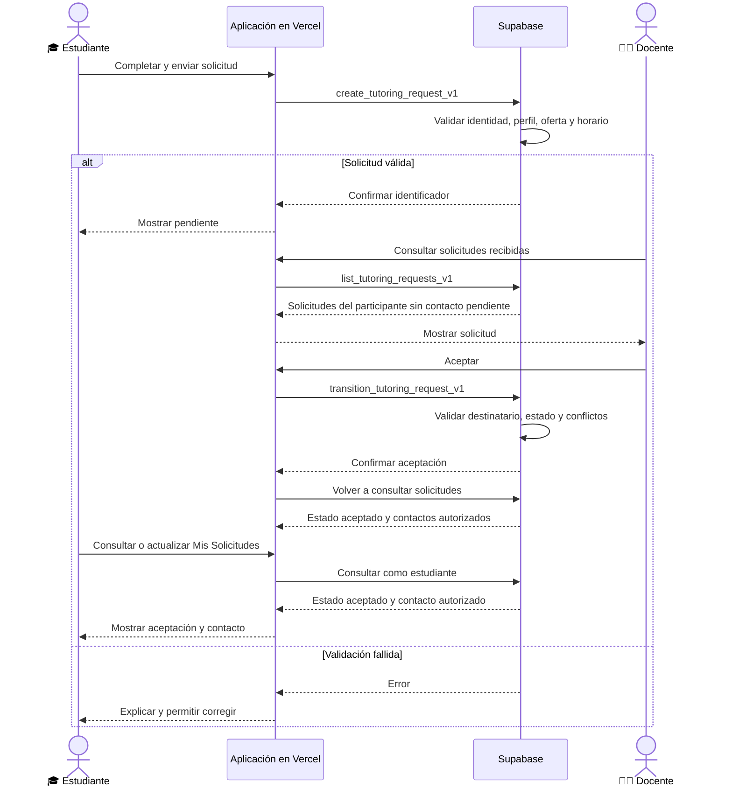
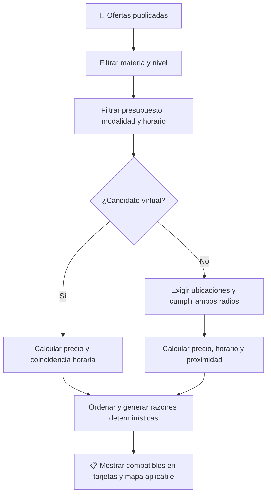

# 🧭 TutorCúcuta: flujos y casos de uso

Documento funcional basado en el código revisado el **29 de septiembre de 2026**.
Aplicación: <https://tutor-cucuta.vercel.app/>.

Describe el comportamiento implementado; no constituye una certificación de todos
los flujos en producción. Los diagramas se dibujan con Mermaid, compatible con
GitHub y visores Markdown con soporte Mermaid. Cada diagrama tiene una explicación
textual para lectores que no puedan renderizarlo.

## 🎯 Propósito y alcance

Conectar estudiantes con docentes particulares del Área Metropolitana de Cúcuta.
El estudiante compara ofertas mediante materia, nivel educativo, modalidad,
presupuesto, horario y proximidad; el sistema filtra y explica la compatibilidad.

La plataforma permite autenticarse, guardar perfiles, publicar ofertas, consultar
soportes, conservar favoritos y gestionar solicitudes. La coordinación de una
solicitud aceptada se realiza mediante el contacto autorizado.

Quedan fuera del alcance pagos, facturación, chat interno, videollamadas,
certificación de documentos, seguimiento GPS continuo y rutas de transporte.

## 👥 Actores

| Actor | Responsabilidad |
| --- | --- |
| 🎓 Estudiante | Buscar, comparar, guardar favoritos y solicitar o cancelar tutorías. |
| 👨‍🏫 Docente | Mantener su perfil, publicar su oferta y aceptar o rechazar solicitudes. |
| 👪 Acudiente | Persona de referencia para estudiantes menores; no tiene un portal independiente implementado. |
| 🔐 Supabase Auth | Autenticar por Google/correo y gestionar sesiones y recuperación. |
| 🗄️ Supabase Database y Storage | Persistir datos, aplicar permisos y almacenar archivos privados. |
| 🗺️ Navegador y MapLibre/OpenFreeMap | Solicitar permiso de ubicación y representar zonas aproximadas. |

Una cuenta conserva un único rol. Elegir otro botón en la portada no cambia el rol
persistido de una cuenta existente.

## 🔑 Flujo de acceso

El sistema restaura la sesión cuando es válida. Ante errores de acceso o lectura
muestra un mensaje y permite reintentar. La recuperación requiere un enlace válido;
abrir únicamente la URL de recuperación no equivale a completar ese flujo.

## 🎓 Flujo del estudiante

Guardar un favorito requiere confirmación de Supabase. La lista pertenece a la
cuenta y se recupera al iniciar sesión; un fallo de escritura no se presenta como
un guardado exitoso.

## 👨‍🏫 Flujo del docente

**Guardar perfil y publicar oferta son acciones distintas.** Publicar comparte
los campos de la oferta; no hace público todo el perfil privado. Retirar la oferta
la excluye del catálogo, sin implicar borrar la cuenta ni su historial.

## 🧩 Casos de uso: vista general

Mermaid no tiene una sintaxis nativa de casos de uso UML. Este diagrama utiliza
óvalos y asociaciones equivalentes mediante `flowchart`; los diagramas de secuencia
y estados posteriores emplean sus sintaxis específicas.

### Contratos funcionales

| ID | Precondición | Flujo principal y resultado | Alternativa o error |
| --- | --- | --- | --- |
| CU-01 | Servicio de autenticación disponible. | Acceder por Google/correo; recuperar la cuenta y abrir su portal. | Credenciales o enlace inválidos: informar el error; no crear una sesión ficticia. |
| CU-02 | Cuenta autenticada. | Editar datos y guardar; mostrar éxito tras confirmación del servidor. | Datos inválidos o conflicto entre sesiones: conservar el error y permitir corregir/recargar. |
| CU-03 | Cuenta docente, perfil y oferta completos. | Declarar tarifa, materias, niveles, modalidades, horarios y contacto; publicar oferta. Puede retirarla posteriormente. | Oferta incompleta, horario inválido o zona presencial ausente: rechazar publicación. |
| CU-04 | Estudiante autenticado y catálogo disponible. | Aplicar criterios, excluir incompatibles, ordenar candidatos y explicar coincidencias. | Sin coincidencias: estado vacío y ajuste de criterios. Sin origen presencial: pedir definir zona. |
| CU-05 | Oferta consultable por el estudiante. | Abrir perfil; consultar documentos aportados mediante acceso temporal autorizado. | Documento retirado, error o falta de autorización: informar sin inventar un soporte. |
| CU-06 | Estudiante autenticado y docente disponible. | Guardar/quitar favorito y recuperar su selección desde Supabase. | Fallo de guardado: mostrar error sin confirmar un cambio inexistente. |
| CU-07 | Perfil estudiantil válido y oferta publicada. | Elegir materia, modalidad, fecha, hora, duración y mensaje; enviar solicitud pendiente. | Menor sin declaración de acudiente, horario fuera de oferta o envío inválido: corregir antes de continuar. |
| CU-08 | Docente destinatario y solicitud pendiente. | Aceptar o rechazar; al aceptar se habilitan los contactos autorizados. | Conflicto horario, fecha pasada o transición no permitida: denegar y actualizar. |
| CU-09 | Estudiante autor; solicitud pendiente o aceptada. | Cancelar; actualizar estado y ocultar contacto en la aplicación. | Otro participante no puede ejecutar esta acción en nombre del estudiante. |
| CU-10 | Docente autenticado. | Subir PDF/JPG/PNG con título o retirar un soporte propio. | Archivo inválido, exceso de tamaño o falta de permiso: informar el error. |

### CU-07 detallado: solicitar tutoría

1. El estudiante abre una oferta y pulsa **Solicitar tutoría**.
2. El formulario comprueba nombre y edad; para adultos exige teléfono y para menores
   nombre, teléfono y declaración de autorización del acudiente.
3. El estudiante selecciona una materia y modalidad de la oferta, fecha futura,
   hora y duración, y puede escribir un mensaje.
4. Supabase valida identidad, oferta, horario y restricciones de la solicitud.
5. Si se confirma la escritura, la solicitud queda **pendiente** y disponible para
   ambos participantes en sus respectivas vistas.
6. Ante un error, la interfaz informa del fallo y permite reintentar. Los reintentos
   del mismo envío conservan su identificador para evitar duplicados.

El tema específico de la búsqueda **no se transmite como campo estructurado** en
el contrato actual de solicitud. El estudiante puede detallarlo en el mensaje;
las vistas omiten el campo `focalTopic` cuando está vacío. La declaración del
acudiente no representa una verificación institucional independiente.

## 🔄 Estados de una solicitud

| Estado | Contacto visible | Acción posterior implementada |
| --- | --- | --- |
| ⏳ Pendiente | No | Docente acepta/rechaza; estudiante cancela. |
| ✅ Aceptada | Solo contactos autorizados para participantes. | Estudiante cancela. |
| ❌ Rechazada | No | Consulta de historial. |
| 🚫 Cancelada | No | Consulta de historial. |

No hay estado «clase completada», pago o valoración implementado en este flujo.
Ocultar un contacto tras cancelar no puede retirar información ya vista o copiada.

## 📬 Secuencia de solicitud y aceptación

Las solicitudes se vuelven a consultar tras acciones, al recuperar el foco y cada
20 segundos mientras la página está visible. Esto no implica notificaciones push,
correo de solicitud ni un chat en tiempo real.

## 🧮 Flujo de recomendación explicable

La ponderación presencial es precio **40 %**, horario **30 %** y proximidad
**30 %**. Para virtual se excluye distancia y se normalizan los pesos restantes.
Los criterios no elegidos reciben el tratamiento neutral definido por el motor.
La puntuación expresa ajuste a los criterios; no certifica calidad docente ni
probabilidad de éxito. La experiencia y los documentos no añaden puntos.

Ejemplo ilustrativo de explicación: «Enseña la materia solicitada, su tarifa está
dentro del presupuesto y su horario coincide con la franja seleccionada». Los
valores concretos se calculan desde la oferta y la búsqueda, no desde textos mock.

## 🗺️ Ubicación y privacidad

- Una lectura puntual del navegador requiere permiso y se reduce a dos decimales
  antes de entrar al estado del mapa. No hay seguimiento continuo del movimiento.
- El docente elige explícitamente la zona aproximada que desea publicar.
- El radio presencial y la cobertura docente delimitan candidatos; la distancia
  corresponde a línea recta entre zonas, no al tiempo de viaje.
- El feed refleja cambios de zonas publicadas. No representa posición GPS en vivo
  ni presencia en línea de docentes.
- Los documentos son aportados por el tutor; su autenticidad no está verificada.

## 🔎 Trazabilidad con la implementación

| Área | Fuente |
| --- | --- |
| Navegación y conexión de vistas | [App.tsx](../src/App.tsx) |
| Sesión y perfiles | [Cuentas](../src/features/accounts/) |
| Oferta y validaciones de perfil | [Contratos](../src/features/marketplace/domain/contracts.ts) |
| RPC y documentos privados | [Adaptador Supabase](../src/features/marketplace/infrastructure/supabaseMarketplace.ts) |
| Actualización de solicitudes | [useRequests](../src/features/marketplace/application/useRequests.ts) |
| Formulario de solicitud | [RequestTutorModal](../src/components/modals/RequestTutorModal.tsx) |
| Filtros, puntuación y razones | [Motor de recomendación](../src/features/recommender/domain/recommender.ts) |
| Favoritos persistentes | [Favoritos](../src/features/favorites/) |
| Geolocalización aproximada | [Adaptador del navegador](../src/features/maps/infrastructure/browserGeolocation.ts) |
| Evidencia de pruebas previas | [Validación hospedada](hosted-validation-2026-09-12.md) |

El sitio está desplegado y su pantalla de acceso fue revisada. La comprobación
completa de los flujos autenticados en el dominio publicado y la auditoría detallada
de permisos siguen siendo actividades de validación separadas de este documento.
