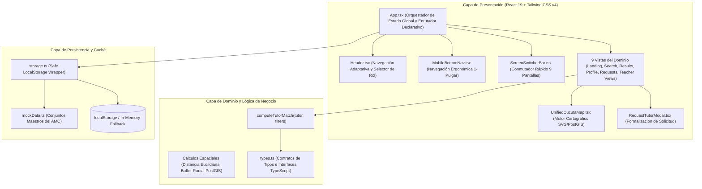
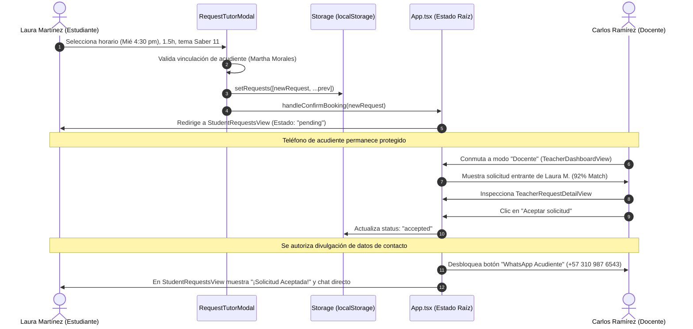

# Documento de Diseño de Arquitectura y Componentes: TutorCúcuta
**Metodología:** Spec-Driven Development (SDD) / Kiro Specification Standard  
**Documento:** `specs/design.md`  
**Versión:** 1.0.0  
**Fecha:** 2026-09-08  
**Estado:** Aprobado / Implementado  

---

## 1. Arquitectura General del Sistema

TutorCúcuta adopta una arquitectura desacoplada y orientada a especificaciones ejecutables, con renderizado reactivo del lado cliente y preparación para servicios geoespaciales PostGIS.



---

## 2. Pila Tecnológica Justificada

| Capa | Tecnología Seleccionada | Versión | Justificación Técnica |
| :--- | :--- | :--- | :--- |
| **Core UI** | React | 19.0.1 | Manejo declarativo de estado con reconciliación rápida de componentes y hooks concurrentes. |
| **Tipado** | TypeScript | 5.8.2 | Tipado estricto (`strict: true`, `noEmit: true`) que previene errores en tiempo de diseño. |
| **Bundler / Server** | Vite | 6.2.3 | Arranque instantáneo (HMR optimizado) y empaquetado de producción ultra-ligero con Rollup/esbuild. |
| **Estilos** | Tailwind CSS | 4.1.14 | Motor compilador `@tailwindcss/vite` sin archivos de configuración pesados, con utilidades CSS modernas. |
| **Iconografía** | Lucide React | 0.546.0 | Set de iconos SVG coherente, accesible y con soporte tree-shaking para optimizar el bundle. |
| **Micro-interacciones** | Motion | 12.23.24 | Animaciones fluidas basadas en resortes y aceleración por GPU para el conmutador de pantallas y modales. |
| **Geomática** | SVG + PostGIS Concept | Vectorial | Representación cartográfica interactiva del AMC sin dependencia forzosa de API keys de terceros. |

---

## 3. Modelo de Datos y Tipos del Dominio (`src/types.ts`)

```typescript
// Roles del sistema
export type Role = 'student' | 'tutor';

// Máquina de estados de 9 pantallas
export type ScreenId = 
  | 'landing'                // Vista 0: Portal de bienvenida y rol
  | 'student-search'         // Vista 1: Formulario de búsqueda multicriterio
  | 'student-results'        // Vista 2: Resultados y lista ponderada
  | 'tutor-profile'          // Vista 3: Hoja de vida pedagógica del tutor
  | 'student-requests'       // Vista 4: Bandeja de solicitudes del alumno
  | 'student-profile-edit'   // Vista 5: Edición de perfil y acudiente
  | 'teacher-dashboard'      // Vista 6: Panel docente de solicitudes
  | 'teacher-request-detail' // Vista 7: Análisis profundo de solicitud
  | 'teacher-profile-edit';  // Vista 8: Perfil profesional docente

// Perfil integral del estudiante con protección de menores
export interface StudentProfile {
  id: string;
  name: string;
  avatarInitials: string;
  avatarUrl?: string;
  age: number;
  grade: string;
  school: string;
  sector: string;
  address: string;
  phone: string;
  email: string;
  guardianName: string;
  guardianPhone: string;
  guardianRelation: string;
  guardianAuthorized: boolean;
  academicGoal: string;
  difficultiesOrTopics: string;
  learningStyles: string[];
  preferredModality: 'presencial' | 'virtual' | 'hibrida';
  preferredSchedule: string;
  bioNote: string;
}

// Oferta pedagógica del tutor
export interface Tutor {
  id: string;
  name: string;
  title: string;
  institution: string;
  avatar: string;
  experienceYears: number;
  ratePerHour: number;
  matchScore: number;
  verified: boolean;
  sector: string;
  distanceKm: number;
  nextAvailable: string;
  modalities: ('presencial' | 'virtual')[];
  subjects: string[];
  levels: string[];
  specialties: string[];
  bio: string;
  methodologySteps: { step: number; title: string; desc: string }[];
  matchReasons: string[];
  coordinates: { x: number; y: number };
}

// Solicitud de tutoría supervisada
export interface StudentRequest {
  id: string;
  studentName: string;
  age: number;
  grade: string;
  guardianLinked: boolean;
  avatarInitials: string;
  studentAvatarUrl?: string;
  sector: string;
  distanceKm: number;
  matchScore: number;
  subject: string;
  focalTopic: string;
  goal: string;
  studentNote: string;
  learningPreferences?: string[];
  learningStyles?: string[];
  guardianName?: string;
  guardianPhone?: string;
  scheduledTime: string;
  durationHours: number;
  ratePerHour: number;
  totalEstimated: number;
  modality: string;
  status: 'pending' | 'accepted' | 'rejected';
  matchCriteriaChecklist: { label: string; checked: boolean }[];
  coordinates: { x: number; y: number };
  targetTutorId?: string;
  targetTutorName?: string;
  createdAt?: string;
}
```

---

## 4. Algoritmo de Emparejamiento Multicriterio (`computeTutorMatch`)

El cálculo de compatibilidad simula la evaluación multicriterio ponderada:

$$\text{Puntaje Base} = 50$$

1. **Concordancia de Materia o Tema:**
   - Materia coincide con especialidad/título: $+25\%$
   - Tema coincide con lista de habilidades: $+20\%$
2. **Concordancia Presupuestaria:**
   - $\text{tarifa} \le \text{presupuesto}$: $+15\%$
   - $\text{tarifa} > \text{presupuesto}$: $-10\%$
3. **Restricción Geoespacial (Radio PostGIS):**
   - $\text{distancia} \le \text{radio}$: $+10\%$
   - $\text{distancia} > \text{radio}$: $-10\%$
4. **Modalidad y Experiencia:**
   - Modalidad compatible: $+5\%$
   - Experiencia $\ge 5$ años: $+5\%$

$$\text{MatchScore Final} = \max(65, \min(99, \text{Puntaje Acumulado}))$$

---

## 5. Arquitectura Cartográfica y Simulación PostGIS

El componente [`UnifiedCucutaMap.tsx`](file:///home/balckyshadown/Escritorio/tutorcúcuta/src/components/common/UnifiedCucutaMap.tsx) integra:
1. **Malla de Teselas Georreferenciadas:** Carga teselas CartoDB Voyager para vista urbana y ArcGIS World Imagery para satélite alrededor de las coordenadas de Cúcuta ($7.8939^\circ\text{ N}, -72.5078^\circ\text{ W}$).
2. **Capa Vectorial SVG:**
   - **Buffer Radial (`ST_DWithin`):** Dibuja círculos SVG con degradado radial y trazo segmentado ajustados por la escala de zoom ($52 \times 2^{\text{zoom}-13} \text{ px/km}$).
   - **Trazado de Ruta Vial (`ST_Distance`):** Curva cuadrática Bezier que representa el trayecto entre La Riviera y Los Caobos pasando por los ejes viales principales (Diagonal Santander / Av. Libertadores) con distintivo de ~8 min de traslado.
   - **Marcadores Interactivos:** Pines HTML con elevación CSS, datos de tarifa en COP/h y soporte táctil para móviles.

---

## 6. Diagrama de Secuencia: Ciclo de Vida de una Solicitud



---

## 7. Registro de Decisiones de Arquitectura (ADRs)

- **ADR-01: Persistencia local estructurada vs backend mock:**  
  *Decisión:* Implementar una capa `storage.ts` con tipado TypeScript estricto y fallback en memoria en lugar de un servidor Express con SQLite simulado, garantizando ejecución offline inmediata en cualquier navegador sin procesos Node concurrentes.
- **ADR-02: Mapa vectorial SVG híbrido con teselas:**  
  *Decisión:* Emplear un visor SVG multicapa con teselas CartoDB/Esri para ofrecer experiencia cartográfica fluida sin incurrir en cuotas ni llaves de Google Maps.
- **ADR-03: Divulgación progresiva de datos personales (Habeas Data):**  
  *Decisión:* Ocultar teléfonos y direcciones exactas en el catálogo general, revelándolos únicamente cuando una solicitud pasa a estado `accepted`.
